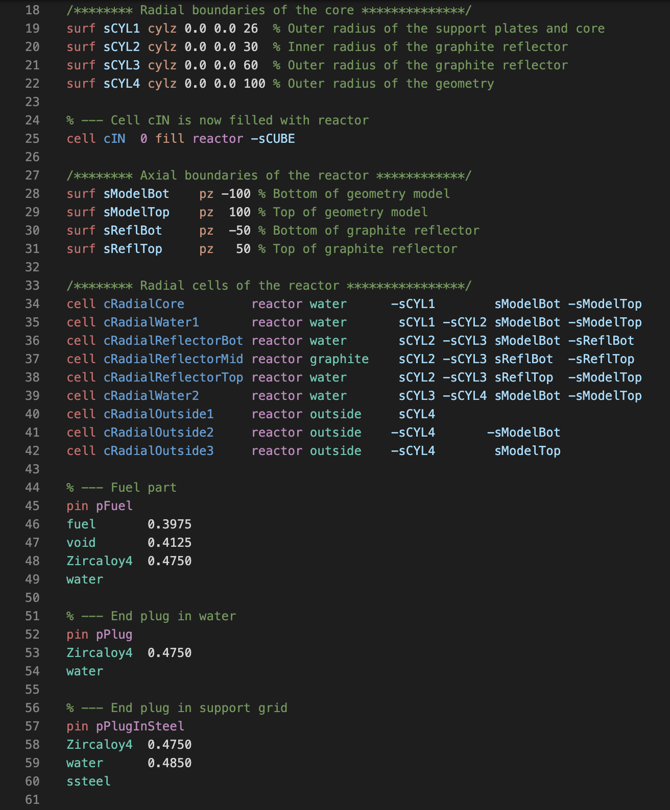

# Serpent Syntax Highlighting

A [Visual Studio Code](https://code.visualstudio.com/) extension to provide syntax highlighting for [Serpent 2](https://serpent.vtt.fi/mediawiki/index.php/Main_Page).

Below is a screenshot of an example from the [Serpent 2 wiki tutorial](https://serpent.vtt.fi/mediawiki/index.php/Tutorial).

# Features
* Syntax highlighting
* Limited error highlighting

# Installation

1. Run [`Install Extension`](https://code.visualstudio.com/docs/editor/extension-gallery#_install-an-extension) command from [Command Palette](https://code.visualstudio.com/Docs/editor/codebasics#_command-palette).
2. Select the extension named `Serpent 2 Syntax Highlighting`.